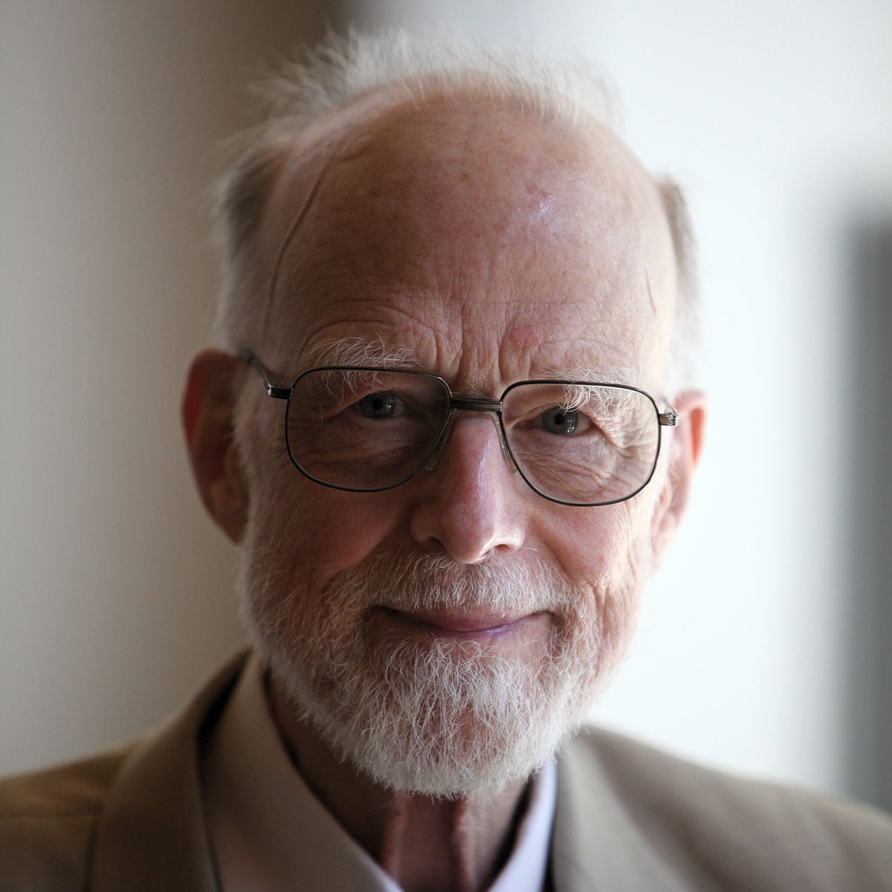

<!-- $theme: gaia -->

Talo
====
---

> *There are two ways of constructing a software design: One way is to make it so simple that there are obviously no deficiencies, and the other way is to make it so complicated that there are no obvious deficiencies. The first method is far more difficult.* -- Tony Hoare



---
### G

- Use DI / IoC
- Don't comment to cover up bad code
- A good code is like a good joke
- Avoid primitive obsession
- Schedule time to 	lower technical debt
- Favor high cohesion
  - frecuency of changes
  - high cohesion == low cyclomatic complexity
- FAvor loose coupling
  - Eliminate if possible :D
- Prefer clear code over clever code
- Meaninful names
- Do tactical code reviews -> Pairing is better
- Reduce state and mutation

---

> *Think more, type less. Aim for minimalism, fewer states, less mutability, and just enough code for the known, relevant parts of the problem.* -- Venkat Subramaniam


---
### Kent Beck's Rule for Simple Design

- Passes the tests
- Reveal Intention
- No duplication
- Fewest elements

<!--The rules are in priority order-->

---
### Venkat's Theory

```java
// Find the total of sqrt of first k prime numbers
// starting with n

public static double compute(int n, int, k) {
  int index = 0;
  int count = 0;
  double total = 0;
  while(count < n) {
    if(isPrime(index)) {
      total += Math.sqrt(index);
      count++;
    }
    index++;
  }
  return total;
}
```

---
### Venkat's Theory

> *It's code like this that prematurely turns programmers into managers* -- Venkat Subramaniam


---

### Venkat's Theory

```java
// Find the total of sqrt of first k prime numbers
// starting with n

public static double compute(int n, int, k) {
  return Stream.iterate(n, e -> e + 1)
               .filter(Sample::isPrime)
               .mapToDouble(Math::sqrt)
               .limit(k)
               .sum();
}
```